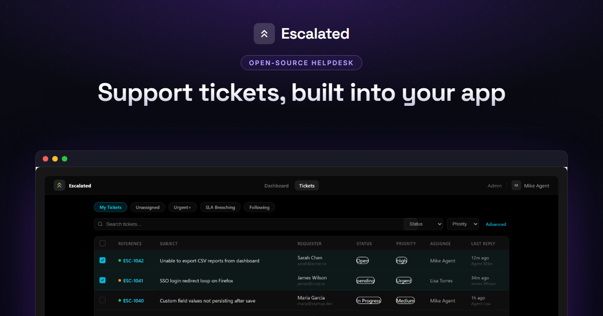
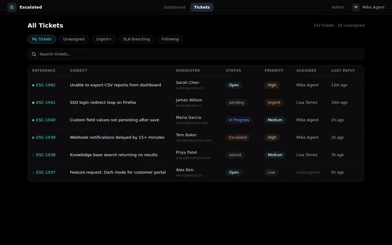

<p align="center">
  <a href="docs/translations/README.ar.md">العربية</a> •
  <a href="docs/translations/README.de.md">Deutsch</a> •
  <b>English</b> •
  <a href="docs/translations/README.es.md">Español</a> •
  <a href="docs/translations/README.fr.md">Français</a> •
  <a href="docs/translations/README.it.md">Italiano</a> •
  <a href="docs/translations/README.ja.md">日本語</a> •
  <a href="docs/translations/README.ko.md">한국어</a> •
  <a href="docs/translations/README.nl.md">Nederlands</a> •
  <a href="docs/translations/README.pl.md">Polski</a> •
  <a href="docs/translations/README.pt-BR.md">Português (BR)</a> •
  <a href="docs/translations/README.ru.md">Русский</a> •
  <a href="docs/translations/README.tr.md">Türkçe</a> •
  <a href="docs/translations/README.zh-CN.md">简体中文</a>
</p>

<h1>
  
  Escalated
</h1>

[](https://github.com/escalated-dev/escalated/actions/workflows/run-tests.yml)
[](https://app.fossa.com/projects/custom%2B62107%2Fgithub.com%2Fescalated-dev%2Fescalated?ref=badge_shield)
[](https://www.npmjs.com/package/@escalated-dev/escalated)
[](https://vuejs.org/)
[](https://opensource.org/licenses/MIT)

<p align="center">
  <a href="https://escalated.dev">
    
  </a>
</p>

<p align="center">
  
</p>

Escalated is an embeddable support ticket system with SLA tracking, escalation rules, agent workflows, and a customer portal. This repo contains all the shared frontend assets (Vue 3 + Inertia.js) used across every supported backend framework.

👉 **Learn more, view demos, and compare Cloud vs Self-Hosted options at** **[https://escalated.dev](https://escalated.dev)**

**You don't install this package directly.** Start with the backend package for your framework — it handles everything including pulling in these frontend assets.

## Features

- **Ticket splitting** — Split a reply into a new standalone ticket while preserving context
- **Ticket snooze** — Snooze tickets with presets (1h, 4h, tomorrow, next week) and automatic wake
- **Saved views / custom queues** — Save, name, and share filter presets as reusable ticket views
- **Embeddable support widget** — Drop-in `<script>` widget with KB search, ticket form, and status check
- **Real-time updates** — WebSocket support (Pusher/Reverb/Soketi) with automatic polling fallback
- **Knowledge base toggle** — Enable or disable the public knowledge base from admin settings
- **CI: ESLint + Prettier** — Automated code style enforcement on every pull request

## Get Started

Pick your framework:

| Framework | Repo | Install |
|-----------|------|---------|
| **Laravel** | [escalated-dev/escalated-laravel](https://github.com/escalated-dev/escalated-laravel) | `composer require escalated-dev/escalated-laravel` |
| **Rails** | [escalated-dev/escalated-rails](https://github.com/escalated-dev/escalated-rails) | `gem "escalated"` |
| **Django** | [escalated-dev/escalated-django](https://github.com/escalated-dev/escalated-django) | `pip install escalated-django` |
| **AdonisJS** | [escalated-dev/escalated-adonis](https://github.com/escalated-dev/escalated-adonis) | `npm install @escalated-dev/escalated-adonis` |
| **WordPress** | [escalated-dev/escalated-wordpress](https://github.com/escalated-dev/escalated-wordpress) | [Download escalated.zip](https://github.com/escalated-dev/escalated-wordpress/releases/latest) |
| **Filament** | [escalated-dev/escalated-filament](https://github.com/escalated-dev/escalated-filament) | `composer require escalated-dev/escalated-filament` |
| **React Native** | [escalated-dev/escalated-react-native](https://github.com/escalated-dev/escalated-react-native) | `npm install @escalated-dev/escalated-react-native` |
| **Flutter** | [escalated-dev/escalated-flutter](https://github.com/escalated-dev/escalated-flutter) | See [pubspec.yaml setup](https://github.com/escalated-dev/escalated-flutter#quick-start) |

Each backend repo has full setup instructions — install command, migrations, config, and frontend integration.

## Tailwind CSS

Escalated components use Tailwind CSS utility classes (~hundreds of them across 140+ Vue files). **Some Tailwind-compatible class processor must be available in the host app for the UI to render correctly** — without one, every component renders as unstyled DOM with class names that don't resolve to any CSS.

### Recommended: Tailwind in your existing build

If your host app already uses Tailwind via Vite / PostCSS / Tailwind CLI, just add this package to your `content` config so its classes aren't purged:

```js
// tailwind.config.js
export default {
    content: [
        // ... your existing paths
        './node_modules/@escalated-dev/escalated/src/**/*.vue',
    ],
}
```

> **Tailwind 4+ users:** `content` globs are auto-detected from imported modules — you usually don't need to add anything. Skip this step if you're on v4.

### Using Escalated without a Tailwind build step

If you don't want a Tailwind toolchain in your build pipeline, you have a few options. Each has trade-offs — pick the one closest to your project's constraints:

| Option | When to use | How |
|---|---|---|
| **Tailwind Play CDN** | Prototyping, internal tools, demos. Not recommended for production (no purging, ~3 MB script tag). | Add `<script src="https://cdn.tailwindcss.com"></script>` to the page that renders Escalated. The CDN script JIT-compiles classes at runtime. |
| **Tailwind standalone CLI** | You want a static stylesheet without npm/Vite. | Download the [standalone CLI binary](https://tailwindcss.com/blog/standalone-cli) and run `tailwindcss -i input.css -o public/escalated.css --content './node_modules/@escalated-dev/escalated/src/**/*.vue' --minify`. Link the output stylesheet from your page. |
| **UnoCSS / Twind in attributify mode** | Already using one of these atomic-CSS engines. | Configure with the Tailwind preset (`@unocss/preset-wind` or `@twind/preset-tailwind`) and add the Escalated package path to the engine's scan config. Class semantics match. |
| **Forking with hand-rolled CSS** | You categorically cannot ship any Tailwind-compatible tooling and are willing to maintain a fork. | Replace utility classes with scoped CSS per component. Substantial effort; not officially supported. |

If none of these fit, please [open a discussion](https://github.com/escalated-dev/escalated/discussions) so we can understand the constraint and consider a pre-compiled CSS distribution.

Whatever path you choose, also make sure the [theme tokens](#theming) (CSS custom properties) are applied — those control colour, spacing, and radius and are independent of Tailwind.

## Theming

Escalated renders inside a standalone layout by default. To integrate it into your app's design system, use the `EscalatedPlugin`:

```js
import { createApp } from 'vue'
import { EscalatedPlugin } from '@escalated-dev/escalated'
import AppLayout from '@/Layouts/AppLayout.vue'

const app = createApp(...)

app.use(EscalatedPlugin, {
    layout: AppLayout,
    theme: {
        primary: '#3b82f6',
        radius: '0.75rem',
    }
})
```

### Layout Integration

Pass your app's layout component and all Escalated pages render inside it automatically. The layout component must accept a `#header` slot and a default slot:

```vue
<!-- Your layout must support these slots -->
<template>
    <div>
        <nav>...</nav>
        <header><slot name="header" /></header>
        <main><slot /></main>
    </div>
</template>
```

When no layout is provided, Escalated uses its own built-in navigation bar.

### CSS Custom Properties

The `theme` option sets CSS custom properties you can reference in your own styles:

| Property | Default | Description |
|----------|---------|-------------|
| `--esc-primary` | `#4f46e5` | Primary action color |
| `--esc-primary-hover` | auto-darkened | Primary hover color |
| `--esc-radius` | `0.5rem` | Border radius for inputs and buttons |
| `--esc-radius-lg` | auto-scaled | Border radius for cards and panels |
| `--esc-font-family` | inherit | Font family override |

### Framework Examples

**Laravel** (Inertia + Vue 3):
```js
import { EscalatedPlugin } from '@escalated-dev/escalated'
import AuthenticatedLayout from '@/Layouts/AuthenticatedLayout.vue'

app.use(EscalatedPlugin, { layout: AuthenticatedLayout })
```

**Rails** (Inertia + Vue 3):
```js
import { EscalatedPlugin } from '@escalated-dev/escalated'
import AppLayout from '@/layouts/AppLayout.vue'

app.use(EscalatedPlugin, { layout: AppLayout })
```

**Django** (Inertia + Vue 3):
```js
import { EscalatedPlugin } from '@escalated-dev/escalated'
import BaseLayout from '@/layouts/BaseLayout.vue'

app.use(EscalatedPlugin, { layout: BaseLayout })
```

**AdonisJS** (Inertia + Vue 3):
```js
import { EscalatedPlugin } from '@escalated-dev/escalated'
import AppLayout from '@/layouts/AppLayout.vue'

app.use(EscalatedPlugin, { layout: AppLayout })
```

## What's in This Repo

All the Vue 3 + Inertia.js components that power the Escalated UI. These are identical across Laravel, Rails, Django, and AdonisJS — the backend framework renders them via Inertia.

## 📸 Screenshots

> Screenshots are auto-generated from Storybook via the [component-screenshots](.github/workflows/screenshots.yml) workflow.

<p align="center">
  <strong>Admin Panel (Dark)</strong><br/>
  
</p>

<p align="center">
  <strong>Admin Panel (Light)</strong><br/>
  
</p>

<p align="center">
  <strong>Ticket Queue</strong><br/>
  
</p>

<p align="center">
  <strong>Agent Panel</strong><br/>
  
</p>

<p align="center">
  <strong>Ticket Detail View</strong><br/>
  
</p>

### Pages

**Customer Portal** — Self-service ticket management
- `pages/Customer/Index.vue` — Ticket list with status filters and search
- `pages/Customer/Create.vue` — New ticket form with file attachments
- `pages/Customer/Show.vue` — Ticket detail with reply thread

**Agent Dashboard** — Ticket queue and workflows
- `pages/Agent/Dashboard.vue` — Stats overview and recent tickets
- `pages/Agent/TicketIndex.vue` — Filterable ticket queue
- `pages/Agent/TicketShow.vue` — Full ticket view with sidebar, internal notes, canned responses

**Admin Panel** — System configuration
- `pages/Admin/Reports.vue` — Analytics dashboard
- `pages/Admin/Departments/` — Department CRUD
- `pages/Admin/SlaPolicies/` — SLA policy management
- `pages/Admin/EscalationRules/` — Escalation rule builder
- `pages/Admin/Tags/` — Tag management
- `pages/Admin/CannedResponses/` — Canned response templates

### Shared Components

Reusable building blocks used across the pages above.

| Component | Description |
|-----------|-------------|
| `StatusBadge` | Colored badge for ticket status |
| `PriorityBadge` | Colored badge for ticket priority |
| `TicketList` | Paginated ticket table |
| `ReplyThread` | Chronological reply display |
| `ReplyComposer` | Reply/note editor with file upload and canned response insertion |
| `ActivityTimeline` | Audit log of ticket events |
| `SlaTimer` | SLA countdown with breach/warning states |
| `TicketFilters` | Status, priority, agent, department filter bar |
| `TicketSidebar` | Ticket detail sidebar (status, SLA, tags, activity) |
| `AssigneeSelect` | Agent assignment dropdown |
| `TagSelect` | Multi-select tag picker |
| `FileDropzone` | Drag-and-drop file upload |
| `AttachmentList` | File attachment display with download links |
| `StatsCard` | Metric card with label, value, and trend |
| `EscalatedLayout` | Top-level layout with navigation (supports host layout injection) |
| `BulkActionBar` | Toolbar for batch operations on selected tickets |
| `QuickFilters` | One-click filter chips (My Tickets, Unassigned, Urgent, SLA Breaching) |
| `MacroDropdown` | Dropdown to apply multi-step macros to a ticket |
| `FollowButton` | Toggle button to follow/unfollow a ticket |
| `SatisfactionRating` | 1-5 star CSAT rating input with optional comment |
| `KeyboardShortcutHelp` | Modal overlay showing all available keyboard shortcuts |
| `PinnedNotes` | Display pinned internal notes at the top of the thread |
| `PresenceIndicator` | Real-time indicator showing who is viewing a ticket |

### Composables

| Composable | Description |
|------------|-------------|
| `useKeyboardShortcuts` | Registers and manages keyboard shortcuts for ticket actions |

### Plugin

| Export | Description |
|--------|-------------|
| `EscalatedPlugin` | Vue plugin for layout injection and CSS theming |

## Plugin Development

Escalated supports framework-agnostic plugins built with the [Plugin SDK](https://github.com/escalated-dev/escalated-plugin-sdk). Plugins are written once in TypeScript and work across all Escalated backends.

### How the Frontend Plugin System Works

The frontend uses `defineEscalatedPlugin()` to register Vue components — custom admin pages, ticket sidebar widgets, or dashboard panels — that are mounted automatically when the plugin is active.

```typescript
import { defineEscalatedPlugin } from '@escalated-dev/escalated'
import MySettingsPage from './MySettingsPage.vue'

export default defineEscalatedPlugin({
  name: 'my-plugin',
  pages: {
    'admin/my-plugin/settings': MySettingsPage,
  },
})
```

### How It Connects to the Backend

The backend uses `definePlugin()` from the [Plugin SDK](https://github.com/escalated-dev/escalated-plugin-sdk) to handle TypeScript business logic — subscribing to ticket lifecycle hooks, exposing API endpoints, and persisting data. The frontend and backend entries work together as a single npm package.

```typescript
// backend entry (index.ts)
import { definePlugin } from '@escalated-dev/plugin-sdk'

export default definePlugin({
  name: 'my-plugin',
  version: '1.0.0',
  actions: {
    'ticket.created': async (event, ctx) => {
      ctx.log.info('New ticket!', event)
    },
  },
})
```

### Quick Example: Both Entry Points

A published plugin package typically exports both:

```
my-plugin/
  index.ts          ← backend: definePlugin() for TypeScript logic
  frontend.ts       ← frontend: defineEscalatedPlugin() for Vue components
```

The backend framework (Laravel, Rails, Django, AdonisJS) loads `index.ts` via the [Plugin Runtime](https://github.com/escalated-dev/escalated-plugin-runtime). The Vue app imports `frontend.ts` and registers it with `app.use()`.

### Installing Plugins

```bash
npm install @escalated-dev/plugin-slack
npm install @escalated-dev/plugin-jira
```

### Resources

- [Plugin SDK](https://github.com/escalated-dev/escalated-plugin-sdk) — TypeScript SDK for building plugins
- [Plugin Runtime](https://github.com/escalated-dev/escalated-plugin-runtime) — Runtime host for plugins
- [Plugin Development Guide](https://github.com/escalated-dev/escalated-docs) — Full documentation

## For Package Maintainers

If you're building a new backend integration, this package is available on npm:

```bash
npm install @escalated-dev/escalated
```

```js
// Import the plugin
import { EscalatedPlugin } from '@escalated-dev/escalated'

// Import individual components
import { StatusBadge, SlaTimer } from '@escalated-dev/escalated'

// Or reference pages directly for Inertia resolution
import CustomerIndex from '@escalated-dev/escalated/pages/Customer/Index.vue'
```

Peer dependencies: `vue` ^3.3.0, `@inertiajs/vue3` ^1.0.0 || ^2.0.0

## Ecosystem

This is the shared frontend for the Escalated support ticket system. Host framework packages and client SDKs available across the ecosystem:

- **[Escalated for Laravel](https://github.com/escalated-dev/escalated-laravel)** — Laravel Composer package
- **[Escalated for Rails](https://github.com/escalated-dev/escalated-rails)** — Ruby on Rails engine
- **[Escalated for Django](https://github.com/escalated-dev/escalated-django)** — Django reusable app
- **[Escalated for AdonisJS](https://github.com/escalated-dev/escalated-adonis)** — AdonisJS v6 package
- **[Escalated for WordPress](https://github.com/escalated-dev/escalated-wordpress)** — WordPress plugin
- **[Escalated for Filament](https://github.com/escalated-dev/escalated-filament)** — Filament v3 admin panel plugin
- **[Escalated for React Native](https://github.com/escalated-dev/escalated-react-native)** — React Native SDK
- **[Escalated for Flutter](https://github.com/escalated-dev/escalated-flutter)** — Flutter SDK
- **[Shared Frontend](https://github.com/escalated-dev/escalated)** — Vue 3 + Inertia.js UI components (you are here)

## License

MIT
