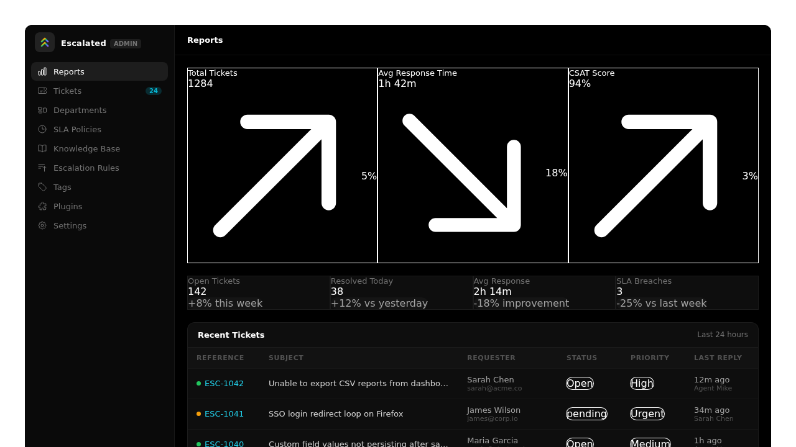
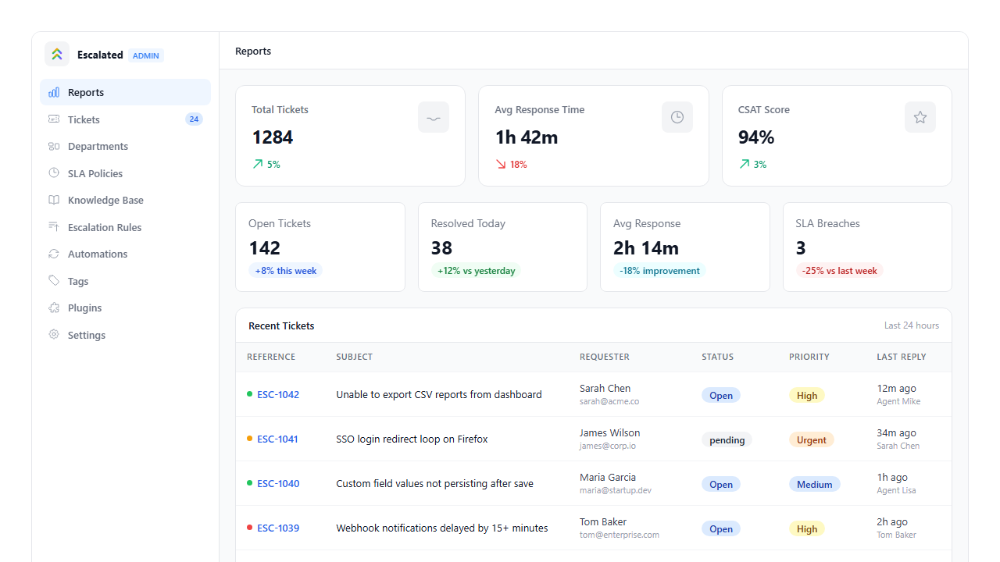
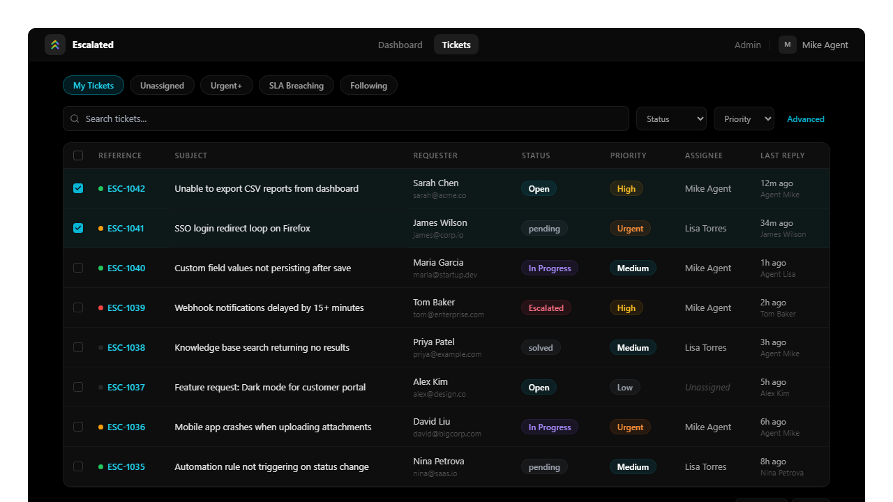
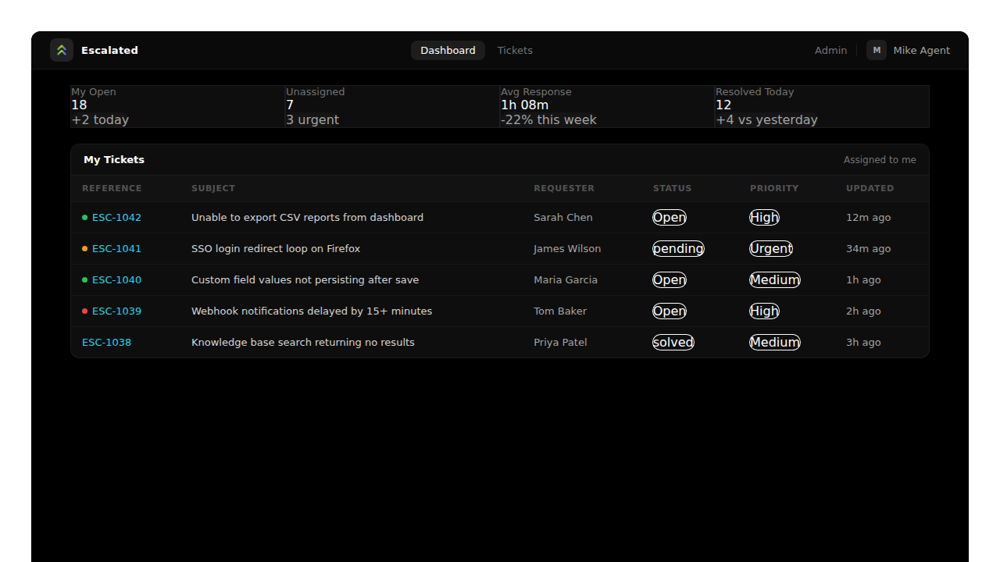
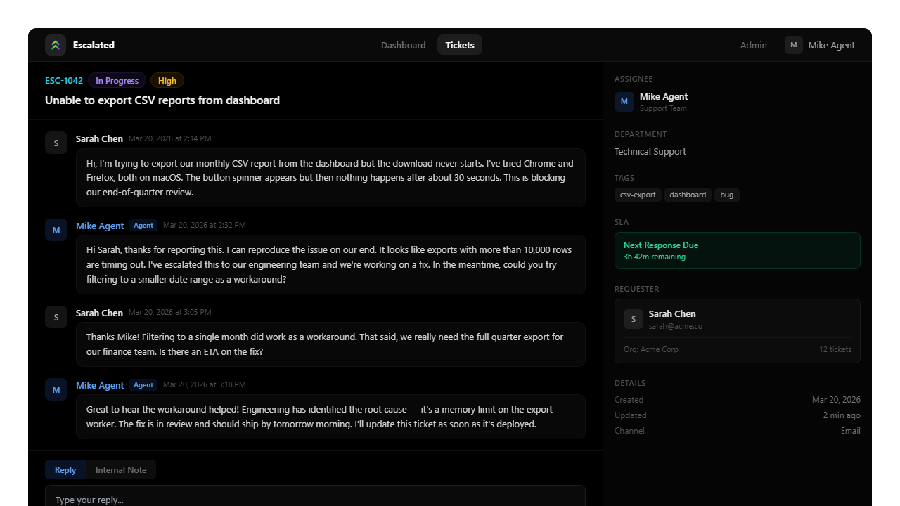

<p align="center">
  <a href="README.ar.md">العربية</a> •
  <a href="README.de.md">Deutsch</a> •
  <a href="../../README.md">English</a> •
  <a href="README.es.md">Español</a> •
  <a href="README.fr.md">Français</a> •
  <a href="README.it.md">Italiano</a> •
  <a href="README.ja.md">日本語</a> •
  <a href="README.ko.md">한국어</a> •
  <a href="README.nl.md">Nederlands</a> •
  <a href="README.pl.md">Polski</a> •
  <a href="README.pt-BR.md">Português (BR)</a> •
  <a href="README.ru.md">Русский</a> •
  <a href="README.tr.md">Türkçe</a> •
  <b>简体中文</b>
</p>

<h1>
  
  Escalated
</h1>

[](https://github.com/escalated-dev/escalated/actions/workflows/run-tests.yml)
[](https://www.npmjs.com/package/@escalated-dev/escalated)
[](https://vuejs.org/)
[](https://opensource.org/licenses/MIT)

Escalated 是一个可嵌入的支持工单系统，具备 SLA 跟踪、升级规则、客服工作流和客户门户。此仓库包含所有支持的后端框架中使用的共享前端资源（Vue 3 + Inertia.js）。

👉 **了解更多、查看演示、比较云端与自托管方案，请访问** **[https://escalated.dev](https://escalated.dev)**

**请勿直接安装此包。** 请从您框架的后端包开始 - 它会处理一切，包括引入这些前端资源。

## 功能特性

- **工单拆分** — 将回复拆分为新的独立工单，同时保留上下文
- **工单暂停** — 使用预设（1小时、4小时、明天、下周）暂停工单并自动唤醒
- **保存的视图 / 自定义队列** — 保存、命名和共享筛选预设作为可重用的工单视图
- **可嵌入的支持小部件** — 即插即用的 `<script>` 小部件，包含知识库搜索、工单表单和状态检查
- **实时更新** — WebSocket 支持（Pusher/Reverb/Soketi），带自动轮询回退
- **知识库开关** — 从管理设置中启用或禁用公共知识库
- **CI：ESLint + Prettier** — 每次拉取请求自动执行代码风格检查

## 快速开始

选择您的框架：

| 框架 | 仓库 | 安装 |
|-----------|------|---------|
| **Laravel** | [escalated-dev/escalated-laravel](https://github.com/escalated-dev/escalated-laravel) | `composer require escalated-dev/escalated-laravel` |
| **Rails** | [escalated-dev/escalated-rails](https://github.com/escalated-dev/escalated-rails) | `gem "escalated"` |
| **Django** | [escalated-dev/escalated-django](https://github.com/escalated-dev/escalated-django) | `pip install escalated-django` |
| **AdonisJS** | [escalated-dev/escalated-adonis](https://github.com/escalated-dev/escalated-adonis) | `npm install @escalated-dev/escalated-adonis` |
| **WordPress** | [escalated-dev/escalated-wordpress](https://github.com/escalated-dev/escalated-wordpress) | [下载 escalated.zip](https://github.com/escalated-dev/escalated-wordpress/releases/latest) |
| **Filament** | [escalated-dev/escalated-filament](https://github.com/escalated-dev/escalated-filament) | `composer require escalated-dev/escalated-filament` |
| **React Native** | [escalated-dev/escalated-react-native](https://github.com/escalated-dev/escalated-react-native) | `npm install @escalated-dev/escalated-react-native` |
| **Flutter** | [escalated-dev/escalated-flutter](https://github.com/escalated-dev/escalated-flutter) | 参见 [pubspec.yaml 设置](https://github.com/escalated-dev/escalated-flutter#quick-start) |

每个后端仓库都有完整的设置说明 — 安装命令、迁移、配置和前端集成。

## Tailwind CSS

Escalated 组件使用 Tailwind CSS 类。您**必须**将此包添加到 Tailwind 的 `content` 配置中，以防止其类被清除：

```js
// tailwind.config.js
export default {
    content: [
        // ... 您现有的路径
        './node_modules/@escalated-dev/escalated/src/**/*.vue',
    ],
}
```

如果不这样做，Escalated UI 会渲染但按钮背景和徽章颜色等样式将缺失。

## 主题定制

Escalated 默认在独立布局中渲染。要将其集成到您应用的设计系统中，请使用 `EscalatedPlugin`：

```js
import { createApp } from 'vue'
import { EscalatedPlugin } from '@escalated-dev/escalated'
import AppLayout from '@/Layouts/AppLayout.vue'

const app = createApp(...)

app.use(EscalatedPlugin, {
    layout: AppLayout,
    theme: {
        primary: '#3b82f6',
        radius: '0.75rem',
    }
})
```

### 布局集成

传入您应用的布局组件，所有 Escalated 页面将自动在其中渲染。布局组件必须接受 `#header` 插槽和默认插槽：

```vue
<!-- 您的布局必须支持这些插槽 -->
<template>
    <div>
        <nav>...</nav>
        <header><slot name="header" /></header>
        <main><slot /></main>
    </div>
</template>
```

当未提供布局时，Escalated 使用其自带的导航栏。

### CSS 自定义属性

`theme` 选项设置您可以在自己样式中引用的 CSS 自定义属性：

| 属性 | 默认值 | 描述 |
|----------|---------|-------------|
| `--esc-primary` | `#4f46e5` | 主要操作颜色 |
| `--esc-primary-hover` | 自动加深 | 主要悬停颜色 |
| `--esc-radius` | `0.5rem` | 输入框和按钮的边框圆角 |
| `--esc-radius-lg` | 自动缩放 | 卡片和面板的边框圆角 |
| `--esc-font-family` | 继承 | 字体族覆盖 |

### 框架示例

**Laravel** (Inertia + Vue 3)：
```js
import { EscalatedPlugin } from '@escalated-dev/escalated'
import AuthenticatedLayout from '@/Layouts/AuthenticatedLayout.vue'

app.use(EscalatedPlugin, { layout: AuthenticatedLayout })
```

**Rails** (Inertia + Vue 3)：
```js
import { EscalatedPlugin } from '@escalated-dev/escalated'
import AppLayout from '@/layouts/AppLayout.vue'

app.use(EscalatedPlugin, { layout: AppLayout })
```

**Django** (Inertia + Vue 3)：
```js
import { EscalatedPlugin } from '@escalated-dev/escalated'
import BaseLayout from '@/layouts/BaseLayout.vue'

app.use(EscalatedPlugin, { layout: BaseLayout })
```

**AdonisJS** (Inertia + Vue 3)：
```js
import { EscalatedPlugin } from '@escalated-dev/escalated'
import AppLayout from '@/layouts/AppLayout.vue'

app.use(EscalatedPlugin, { layout: AppLayout })
```

## 仓库内容

驱动 Escalated UI 的所有 Vue 3 + Inertia.js 组件。这些组件在 Laravel、Rails、Django 和 AdonisJS 中完全相同 — 后端框架通过 Inertia 进行渲染。

## 📸 截图

> 截图通过 [component-screenshots](.github/workflows/screenshots.yml) 工作流从 Storybook 自动生成。

<p align="center">
  <strong>管理面板（深色）</strong><br/>
  
</p>

<p align="center">
  <strong>管理面板（浅色）</strong><br/>
  
</p>

<p align="center">
  <strong>工单队列</strong><br/>
  
</p>

<p align="center">
  <strong>客服面板</strong><br/>
  
</p>

<p align="center">
  <strong>工单详情视图</strong><br/>
  
</p>

### 页面

**客户门户** — 自助工单管理
- `pages/Customer/Index.vue` — 带状态筛选和搜索的工单列表
- `pages/Customer/Create.vue` — 带文件附件的新建工单表单
- `pages/Customer/Show.vue` — 带回复线程的工单详情

**客服仪表盘** — 工单队列和工作流
- `pages/Agent/Dashboard.vue` — 统计概览和最近工单
- `pages/Agent/TicketIndex.vue` — 可筛选的工单队列
- `pages/Agent/TicketShow.vue` — 完整工单视图，带侧边栏、内部备注、预设回复

**管理面板** — 系统配置
- `pages/Admin/Reports.vue` — 分析仪表盘
- `pages/Admin/Departments/` — 部门管理（CRUD）
- `pages/Admin/SlaPolicies/` — SLA 策略管理
- `pages/Admin/EscalationRules/` — 升级规则构建器
- `pages/Admin/Tags/` — 标签管理
- `pages/Admin/CannedResponses/` — 预设回复模板

### 共享组件

在上述页面中使用的可重用构建模块。

| 组件 | 描述 |
|-----------|-------------|
| `StatusBadge` | 工单状态彩色徽章 |
| `PriorityBadge` | 工单优先级彩色徽章 |
| `TicketList` | 分页工单表格 |
| `ReplyThread` | 按时间顺序显示回复 |
| `ReplyComposer` | 回复/备注编辑器，带文件上传和预设回复插入 |
| `ActivityTimeline` | 工单事件审计日志 |
| `SlaTimer` | 带违规/警告状态的 SLA 倒计时 |
| `TicketFilters` | 状态、优先级、客服、部门筛选栏 |
| `TicketSidebar` | 工单详情侧边栏（状态、SLA、标签、活动） |
| `AssigneeSelect` | 客服分配下拉菜单 |
| `TagSelect` | 多选标签选择器 |
| `FileDropzone` | 拖放文件上传 |
| `AttachmentList` | 带下载链接的文件附件显示 |
| `StatsCard` | 带标签、数值和趋势的指标卡片 |
| `EscalatedLayout` | 带导航的顶层布局（支持宿主布局注入） |
| `BulkActionBar` | 选中工单的批量操作工具栏 |
| `QuickFilters` | 一键筛选标签（我的工单、未分配、紧急、SLA 违规） |
| `MacroDropdown` | 对工单应用多步骤宏的下拉菜单 |
| `FollowButton` | 关注/取消关注工单的切换按钮 |
| `SatisfactionRating` | 1-5 星 CSAT 评分输入，带可选评论 |
| `KeyboardShortcutHelp` | 显示所有可用键盘快捷键的模态覆盖层 |
| `PinnedNotes` | 在线程顶部显示置顶的内部备注 |
| `PresenceIndicator` | 实时指示器，显示谁在查看工单 |

### 组合式函数

| 组合式函数 | 描述 |
|------------|-------------|
| `useKeyboardShortcuts` | 注册和管理工单操作的键盘快捷键 |

### 插件

| 导出 | 描述 |
|--------|-------------|
| `EscalatedPlugin` | 用于布局注入和 CSS 主题的 Vue 插件 |

## 插件开发

Escalated 支持使用 [Plugin SDK](https://github.com/escalated-dev/escalated-plugin-sdk) 构建的框架无关插件。插件使用 TypeScript 编写一次，即可在所有 Escalated 后端上运行。

### 前端插件系统的工作原理

前端使用 `defineEscalatedPlugin()` 注册 Vue 组件 — 自定义管理页面、工单侧边栏小部件或仪表盘面板 — 当插件激活时会自动挂载。

```typescript
import { defineEscalatedPlugin } from '@escalated-dev/escalated'
import MySettingsPage from './MySettingsPage.vue'

export default defineEscalatedPlugin({
  name: 'my-plugin',
  pages: {
    'admin/my-plugin/settings': MySettingsPage,
  },
})
```

### 如何连接到后端

后端使用 [Plugin SDK](https://github.com/escalated-dev/escalated-plugin-sdk) 的 `definePlugin()` 处理 TypeScript 业务逻辑 — 订阅工单生命周期钩子、暴露 API 端点和持久化数据。前端和后端入口作为单个 npm 包协同工作。

```typescript
// 后端入口 (index.ts)
import { definePlugin } from '@escalated-dev/plugin-sdk'

export default definePlugin({
  name: 'my-plugin',
  version: '1.0.0',
  actions: {
    'ticket.created': async (event, ctx) => {
      ctx.log.info('New ticket!', event)
    },
  },
})
```

### 快速示例：两个入口点

发布的插件包通常导出两者：

```
my-plugin/
  index.ts          ← 后端：用于 TypeScript 逻辑的 definePlugin()
  frontend.ts       ← 前端：用于 Vue 组件的 defineEscalatedPlugin()
```

后端框架（Laravel、Rails、Django、AdonisJS）通过 [Plugin Runtime](https://github.com/escalated-dev/escalated-plugin-runtime) 加载 `index.ts`。Vue 应用导入 `frontend.ts` 并使用 `app.use()` 注册。

### 安装插件

```bash
npm install @escalated-dev/plugin-slack
npm install @escalated-dev/plugin-jira
```

### 资源

- [Plugin SDK](https://github.com/escalated-dev/escalated-plugin-sdk) — 用于构建插件的 TypeScript SDK
- [Plugin Runtime](https://github.com/escalated-dev/escalated-plugin-runtime) — 插件的运行时宿主
- [插件开发指南](https://github.com/escalated-dev/escalated-docs) — 完整文档

## 包维护者指南

如果您正在构建新的后端集成，此包可在 npm 上获取：

```bash
npm install @escalated-dev/escalated
```

```js
// 导入插件
import { EscalatedPlugin } from '@escalated-dev/escalated'

// 导入单个组件
import { StatusBadge, SlaTimer } from '@escalated-dev/escalated'

// 或直接引用页面用于 Inertia 解析
import CustomerIndex from '@escalated-dev/escalated/pages/Customer/Index.vue'
```

对等依赖：`vue` ^3.3.0、`@inertiajs/vue3` ^1.0.0 || ^2.0.0

## 生态系统

这是 Escalated 支持工单系统的共享前端。每个主要框架都有后端包可用：

- **[Escalated for Laravel](https://github.com/escalated-dev/escalated-laravel)** — Laravel Composer 包
- **[Escalated for Rails](https://github.com/escalated-dev/escalated-rails)** — Ruby on Rails 引擎
- **[Escalated for Django](https://github.com/escalated-dev/escalated-django)** — Django 可重用应用
- **[Escalated for AdonisJS](https://github.com/escalated-dev/escalated-adonis)** — AdonisJS v6 包
- **[Escalated for Filament](https://github.com/escalated-dev/escalated-filament)** — Filament v3 管理面板插件
- **[共享前端](https://github.com/escalated-dev/escalated)** — Vue 3 + Inertia.js UI 组件（您在这里）

## 许可证

MIT
